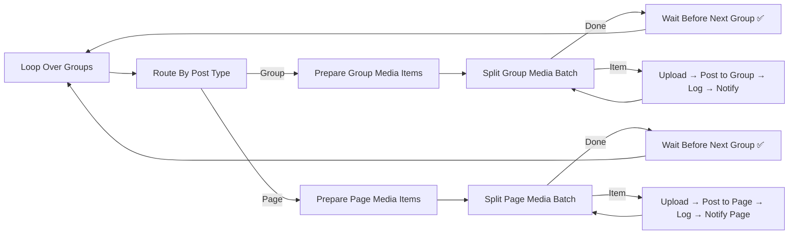
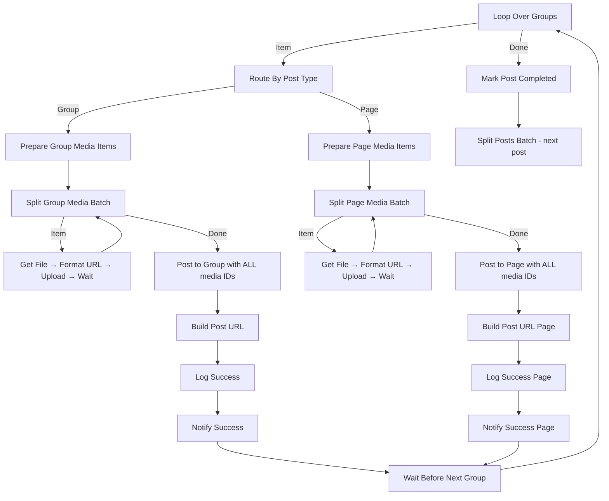

# 🏥 Audit Report - Scheduled_Group_Post_v5

**📅 Date**: 2026-02-27  
**📁 File**: [Scheduled_Group_Post_v5.json](file:///i:/Workflow/n8n/Workflow/New/Scheduled_Group_Post_v5.json)

---

## Summary

| Severity | Count |
|----------|-------|
| 🔴 Critical Issues | 3 |
| 🟡 Warnings | 2 |
| 🟢 Suggestions | 2 |

---

## 🔴 Critical Issues (Phải sửa ngay)

### 🔴 Bug #1: Loop bị đứt — Group path và Page path KHÔNG quay về "Loop Over Groups"

**Đời thường**: Anh có 10 groups, workflow chạy xong group đầu tiên rồi... **đứng luôn**. Nó không quay lại để đăng group thứ 2, 3, 4...

**Chi tiết kỹ thuật**:



Luồng **trông** đúng vì `Wait Before Next Group` → `Loop Over Groups`. Nhưng vấn đề nằm ở **"Split Group Media Batch" / "Split Page Media Batch"**:

- **"Split Group Media Batch"**: output done (index 0) đi tới `Wait Before Next Group` ✅ — OK
- **"Split Page Media Batch"**: output done (index 0) CŨNG đi tới `Wait Before Next Group` ✅ — OK

> **Tuy nhiên**, node **"Prepare Group Media Items"** và **"Prepare Page Media Items"** xử lý ALL items cùng lúc thay vì chỉ xử lý item hiện tại từ "Loop Over Groups". Vì `Loop Over Groups` là SplitInBatches (batchSize = 1 mặc định), mỗi lần nó chỉ emit **1 item**. Nhưng code trong `Prepare Group Media Items` lại dùng `$input.all()` → nó nhận đúng 1 item → tạo ra 1 media item → **chỉ upload 1 ảnh cho 1 group rồi quay lại loop**.

**Vấn đề thực sự ở đây**: Code trong node **"Combine Post + Groups Data"** (line 147) dùng:
```javascript
const postData = $('Parse Media & Groups').first().json;
```
Nó **luôn lấy `.first()`** — tức là chỉ lấy data của post **đầu tiên**. Nếu có nhiều posts Pending, chỉ post đầu tiên được xử lý đúng.

---

### 🔴 Bug #2: "Notify Success" (Group) kết nối SAI — Quay về "Split Group Media Batch" thay vì "Loop Over Groups"

**Đời thường**: Sau khi đăng xong 1 group và gửi thông báo Telegram, workflow quay lại loop **upload ảnh** thay vì quay về **loop chọn group tiếp theo**. Kết quả: nó upload lại ảnh cho cùng group, không chuyển sang group khác.

**Chi tiết kỹ thuật** (line 1540-1549):
```json
"Notify Success": {
  "main": [
    [
      {
        "node": "Split Group Media Batch",  // ❌ SAI - phải quay về Loop Over Groups
        "type": "main",
        "index": 0
      }
    ]
  ]
}
```

**Cách sửa**: `Notify Success` → Sau khi thông báo xong phải đi tới `Wait Before Next Group` (để delay) rồi quay về `Loop Over Groups`.

---

### 🔴 Bug #3: "Notify Success Page" kết nối SAI — Tương tự bug #2 cho Page

**Đời thường**: Giống bug #2 nhưng cho nhánh Page. Sau khi đăng Page, nó quay lại upload ảnh thay vì sang group/page tiếp theo.

**Chi tiết kỹ thuật** (line 1650-1659):
```json
"Notify Success Page": {
  "main": [
    [
      {
        "node": "Split Page Media Batch",  // ❌ SAI - phải quay về Loop Over Groups
        "type": "main",
        "index": 0
      }
    ]
  ]
}
```

**Cách sửa**: `Notify Success Page` → `Wait Before Next Group` → `Loop Over Groups`.

---

## Giải thích tổng thể vấn đề

```
HIỆN TẠI (SAI):
Loop Over Groups → Route → Post to Group → Notify Success → Split Group Media Batch (QUAY LẠI UPLOAD!)
                                                                      ↓
                                                              (lặp vô hạn hoặc đứng)

CẦN SỬA THÀNH:
Loop Over Groups → Route → Post to Group → Notify Success → Wait Before Next Group → Loop Over Groups
                                                                                          ↓
                                                                                    (group tiếp theo!)
```

**Đây chính là lý do**:
1. **Chỉ đăng vào vài group**: Workflow bị kẹt ở vòng lặp media thay vì chuyển sang group tiếp theo
2. **Telegram chỉ thông báo 1 lần**: Vì sau notify, nó quay lại split media (đã hết items) → chạy done branch → kết thúc

---

## 🟡 Warnings (Nên sửa)

### 🟡 Warning #1: Bot Token bị hardcode trong code

**Đời thường**: Token Telegram bot đang nằm trực tiếp trong code. Nếu ai có file này sẽ chiếm được bot của anh.

**File**: Line 264, 278, 401, 415
```
bot8326759079:AAGrogwPkaOEHSLuJR0xuuhNLdEehu_EQ2M
```

**Cách sửa**: Dùng n8n Credentials hoặc Environment Variables thay vì hardcode.

---

### 🟡 Warning #2: `mediaIds` chỉ gửi 1 ảnh (không hỗ trợ multi-photo)

**Đời thường**: Nếu bài đăng có nhiều ảnh, workflow chỉ đính kèm 1 ảnh duy nhất khi post.

**Chi tiết**: 
- Node "Post to Group" (line 343): `"mediaIds": "={{ $('Upload Media to Facebook').item.json.id }}"` — Chỉ lấy `.item` (1 item), không phải tất cả media IDs.
- Tương tự "Post to Page" (line 479).

**Cách sửa**: Thu thập tất cả media IDs sau khi upload xong, ghép thành array rồi truyền vào `mediaIds`.

---

## 🟢 Suggestions (Tùy chọn)

### 🟢 Suggestion #1: Thêm Error Handling

Workflow hiện không có nhánh xử lý lỗi. Nếu Facebook API trả lỗi (rate limit, token hết hạn), workflow sẽ dừng giữa chừng mà không log gì.

### 🟢 Suggestion #2: Tối ưu delay giữa các group

Delay hiện tại 120-360 giây/group. Với 10 groups, tổng thời gian chờ có thể lên tới **60 phút**. Cân nhắc giảm delay nếu không bị rate limit.

---

## 🔧 Proposed Fix (Sơ đồ luồng đúng)



**Thay đổi chính**:
1. ✅ `Notify Success` → `Wait Before Next Group` → `Loop Over Groups` (thay vì quay về Split Media)
2. ✅ `Notify Success Page` → `Wait Before Next Group` → `Loop Over Groups`
3. ✅ Upload tất cả ảnh trước, rồi post 1 lần với tất cả media IDs
4. ✅ Post to Group/Page chuyển ra sau Split Media Done (không ở giữa loop upload)
