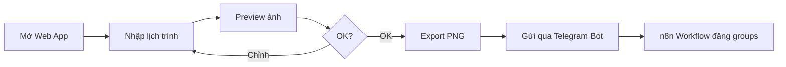

# 🖼️ Image Generator từ PDF Template — XEDUADON247

## Mô tả

Tạo công cụ gen ảnh tự động từ template PDF thiết kế sẵn. Chỉ thay đổi phần **lịch trình** (ngày, giờ, địa điểm) — phần còn lại (logo, ảnh xe, SĐT, header) giữ nguyên. Ảnh output dùng để đăng Facebook groups qua workflow n8n.

## Phân tích Template

Từ file `final.pdf`, template có 2 phần:

| Phần | Nội dung | Thay đổi? |
|------|----------|-----------|
| **Header** | Logo, tiêu đề dịch vụ, SĐT, ảnh xe | ❌ Cố định |
| **Lịch trình** | Ngày, giờ, tuyến đường (2 dòng) | ✅ Thay đổi mỗi lần |

### Dữ liệu động (phần lịch trình):

```
Dòng 1: [Thứ] ([Ngày/Tháng]) [Giờ đi - Giờ đến] → [Điểm đi] → [Điểm đến]
Dòng 2: [Thứ] ([Ngày/Tháng]) [Giờ đi - Giờ đến] → [Điểm đi] → [Điểm đến]
```

Ví dụ:
- THỨ 6 (27/02) 13H30 - 15H00 → ĐÔNG HÀ → SB HUẾ
- THỨ 6 (27/02) 18H00 - 19H00 → SB HUẾ → QUẢNG TRỊ GIO LINH

---

## 2 Phương án

### Phương án A: Web App (khuyến nghị ⭐)

**Ưu điểm**: Giao diện trực quan, xem preview trước khi export, dễ chỉnh sửa

**Công nghệ**:
- HTML/CSS replicate template PDF → render giống hệt
- Form nhập lịch trình (ngày, giờ, tuyến)
- html2canvas / dom-to-image → export ra ảnh PNG
- Có thể tích hợp vào n8n sau (gọi API)

**Tính năng**:
- Form nhập 2 dòng lịch trình
- Preview ảnh real-time
- Nút export/download PNG
- Lưu lịch sử các lịch trình đã tạo (localStorage)

**Stack**: HTML + CSS + Vanilla JS (đơn giản, không framework)

---

### Phương án B: n8n Workflow

**Ưu điểm**: Tự động hoàn toàn, kết hợp luôn với posting workflow

**Cách hoạt động**:
1. Nhận lịch trình từ Telegram hoặc Google Sheets
2. Dùng Code node tạo HTML template
3. Gọi API screenshot (như `https://api.screenshotone.com` hoặc self-host Puppeteer)
4. Upload ảnh lên Telegram → feed vào posting workflow

**Nhược điểm**: 
- Cần API bên ngoài hoặc self-host Puppeteer trên server
- Khó preview trước khi đăng
- Khó chỉnh sửa template

---

## Đề xuất: Phương án A (Web App)

> [!IMPORTANT]
> Anh muốn chọn phương án nào? Web App (A) hay n8n Workflow (B)?  
> Hay muốn kết hợp cả 2 (web app gen ảnh + n8n tự đăng)?

### Nếu chọn Web App, cấu trúc file:

```
i:\Workflow\n8n\Workflow\New\image-generator\
├── index.html          # Trang chính
├── style.css           # CSS giống template PDF
├── script.js           # Logic form + export ảnh
└── assets/
    ├── logo.png        # Logo XEDUADON247
    ├── car.png         # Ảnh xe
    └── bg.png          # Background
```

### Luồng sử dụng:



## Verification Plan

### Manual Testing
1. Mở `index.html` trong browser
2. Nhập thông tin lịch trình vào form
3. Kiểm tra preview có giống template PDF không
4. Bấm export, kiểm tra file PNG chất lượng
5. So sánh ảnh export với ảnh gốc từ PDF
