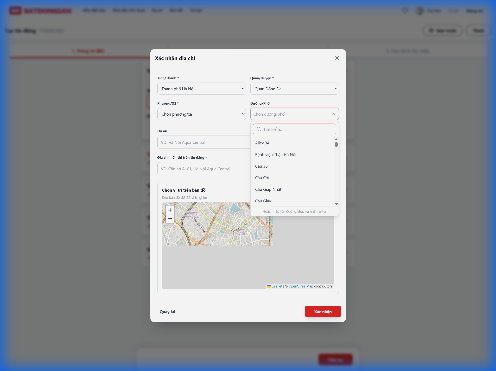
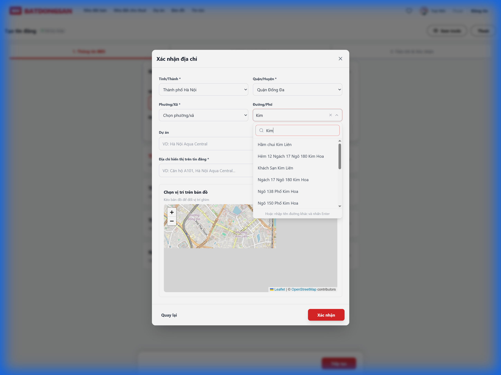

# Walkthrough: Hệ thống Địa chỉ Việt Nam

## Tổng quan
Đã triển khai hoàn chỉnh hệ thống địa chỉ với:
- 63 tỉnh/thành từ `provinces.open-api.vn`
- Đường/phố từ OpenStreetMap (Overpass API)

## Files đã tạo/sửa

### [NEW] [vietnamAddress.ts](file:///i:/Website/BDS/src/lib/vietnamAddress.ts)
API helper cho Tỉnh/Quận/Phường

### [NEW] [streetApi.ts](file:///i:/Website/BDS/src/lib/streetApi.ts)  
API helper lấy đường từ Overpass (OSM)

### [NEW] [StreetCombobox.tsx](file:///i:/Website/BDS/src/components/common/StreetCombobox.tsx)
Searchable dropdown với OSM data + fallback nhập tay

### [MODIFY] [PostingForm.tsx](file:///i:/Website/BDS/src/components/property/PostingForm.tsx)
Tích hợp useVietnamAddress và StreetCombobox

---

## Kết quả test

````carousel

<!-- slide -->

````

## Demo


---

## Lưu ý
- Overpass API có thể timeout khi server bận → component tự fallback cho nhập tay
- Dữ liệu đường được cache để tránh gọi API lại
