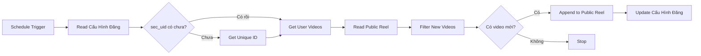

# Hướng dẫn sử dụng Crawl TikTok User Videos Workflow

Em đã tạo xong workflow `Crawl_TikTok.json` để tự động crawl video từ TikTok user và lưu vào sheet.

## Tính năng

1. **Tự động crawl**: Chạy định kỳ 30 phút/lần
2. **Lấy sec_uid tự động**: Nếu chưa có, workflow sẽ tự gọi API
3. **Lọc trùng**: Chỉ lấy video CHƯA có trong `Public Reel`
4. **Giới hạn**: Mỗi lần chỉ lấy 1 video mới nhất
5. **Auto-update**: Tự động cập nhật `sec_uid` và `ID Post Video mới nhất`

## Cấu hình cần thiết

### 1. Thêm cột vào Sheet "Cấu Hình Đăng"
Anh cần thêm 2 cột mới:
- **sec_uid**: Để lưu mã bảo mật của user
- **ID Post Video mới nhất**: Để tracking video mới nhất đã crawl

### 2. Điền RapidAPI Key
Mở file `Crawl_TikTok.json` trong n8n, tìm 2 node:
- **Get Unique ID**
- **Get User Videos**

Thay `YOUR_RAPIDAPI_KEY_HERE` bằng API key thật của anh.

### 3. Import vào n8n
1. Mở n8n
2. Import file `Crawl_TikTok.json`
3. Kiểm tra credentials Google Sheets

## Luồng hoạt động

## Lưu ý quan trọng

- **Node "Filter New Videos"** sử dụng JavaScript để lọc video trùng
- Workflow sẽ **dừng** nếu không có video mới
- Mỗi lần chỉ lấy **1 video** để tránh spam
- `sec_uid` sẽ được lưu lại vào sheet để không phải gọi API lần sau

## Test workflow

1. Đảm bảo sheet `Cấu Hình Đăng` có ít nhất 1 dòng với `Kênh TikTok` và `ID TikTok`
2. Execute workflow thủ công
3. Kiểm tra:
   - Cột `sec_uid` có được điền không?
   - Sheet `Public Reel` có thêm dòng mới không?
   - Cột `ID Post Video mới nhất` có được update không?
