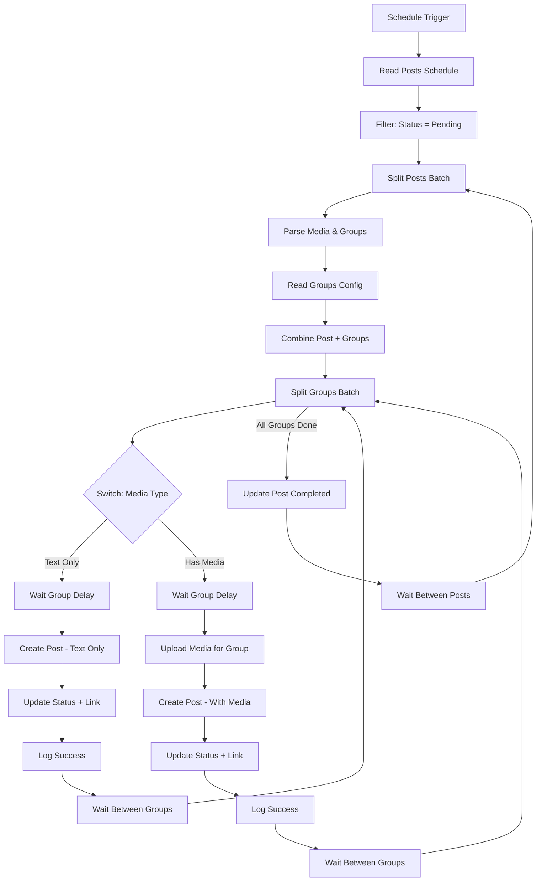

# Workflow V3 - Thiết kế ĐƠN GIẢN theo yêu cầu mới

## Yêu cầu từ USER

> Ban đầu check xem status pending hay completed, pending sẽ xem wf có media, nếu chỉ text sẽ có node **switch (built-in)** rẽ qua text đăng lần lượt từng group. Nếu có media sẽ rẽ nhánh media, upload từng group → đăng bài → cập nhật trạng thái và link luôn.

## Flow Diagram Mới



## Chi tiết các Nodes

### **PHASE 1: Lấy và Filter Posts**

#### 1. Schedule Trigger
- Type: `scheduleTrigger`
- Cron: `0 4,9,13,15,20 * * *`

#### 2. Read Posts Schedule
- Type: `googleSheets`
- Sheet: `Posts_Schedule`

#### 3. Filter: Status = Pending
- Type: `filter` (built-in)
- Condition: `Status === "Pending"`

#### 4. Split Posts Batch
- Type: `splitInBatches`

---

### **PHASE 2: Parse và Combine Data**

#### 5. Parse Media & Groups
- Type: `code`
- Logic: Parse `Media URLs` và `Groups` từ sheet

```javascript
const postData = $input.item.json;

const mediaUrls = String(postData['Media URLs'] || '').split('|')
  .map(url => url.trim())
  .filter(url => url);

const groupIds = String(postData['Groups'] || '').split('|')
  .map(id => id.trim())
  .filter(id => id);

return {
  json: {
    post_id: postData['Post ID'],
    content: postData['Content'],
    media_urls: mediaUrls,
    has_media: mediaUrls.length > 0,  // ← KEY FLAG
    group_ids: groupIds
  }
};
```

#### 6. Read Groups Config
- Type: `googleSheets`
- Sheet: `Groups_Config`

#### 7. Combine Post + Groups Data
- Type: `code`
- Logic: Match groups và tạo items cho từng group

```javascript
const groupsConfig = $('Read Groups Config').all();
const postData = $('Parse Media & Groups').first().json;

const targetGroups = groupsConfig.filter(group => {
  const groupId = String(group.json['Group ID']).trim();
  const isActive = group.json['Active'] === true;
  return postData.group_ids.includes(groupId) && isActive;
});

return targetGroups.map((group, index) => ({
  json: {
    post_id: postData.post_id,
    content: postData.content,
    media_urls: postData.media_urls,
    has_media: postData.has_media,  // ← PASS FLAG
    group_id: String(group.json['Group ID']),
    group_name: group.json['Group Name'],
    page_id: String(group.json['Page ID']),
    access_token: group.json['Access Token'],
    delay_seconds: parseInt(group.json['Delay (seconds)'] || '0'),
    group_index: index + 1,
    total_groups: targetGroups.length
  }
}));
```

#### 8. Split Groups Batch
- Type: `splitInBatches`

---

### **PHASE 3: SWITCH - Rẽ nhánh Text/Media**

#### 9. **Switch: Media Type** ⭐ KEY NODE
- Type: `switch` (built-in n8n)
- Rules:
  - Rule 0: `{{ $json.has_media }} === false` → Output 0 (Text Only)
  - Rule 1: `{{ $json.has_media }} === true` → Output 1 (Has Media)

---

### **NHÁNH TEXT ONLY (Output 0)**

#### 10. Wait Group Delay (Text)
- Type: `wait`
- Duration: `{{ $json.delay_seconds }}`

#### 11. Create Post - Text Only
- Type: `facebookPage` (custom node)
- Config:
  - Content Type: **Text** (hoặc để trống `mediaIds`)
  - Text: `{{ $json.content }}`
  - Page ID: `{{ $json.page_id }}`
  - Group ID: `{{ $json.group_id }}`

#### 12. Update Status + Link (Text)
- Type: `code`
- Logic: Construct URL và pass data cho update

```javascript
const response = $input.first().json;
const groupData = $('Switch: Media Type').item.json;

const postId = response.id || response.postInfo?.id || '';
const postIdParts = postId.split('_');
const actualPostId = postIdParts[1] || postId;

return {
  json: {
    ...groupData,
    post_url: `https://www.facebook.com/groups/${groupData.group_id}/permalink/${actualPostId}/`,
    post_id_facebook: postId
  }
};
```

#### 13. Log Success (Text)
- Type: `googleSheets`
- Operation: Append to `Post_Logs`

#### 14. Wait Between Groups (Text)
- Type: `wait`
- Duration: Fixed or dynamic

---

### **NHÁNH HAS MEDIA (Output 1)**

#### 15. Wait Group Delay (Media)
- Type: `wait`
- Duration: `{{ $json.delay_seconds }}`

#### 16. Upload Media for Group ⭐ KEY NODE
- Type: `code` + Loop
- Logic: Upload TẤT CẢ media cho group này

**Sub-flow** (có thể là sub-workflow hoặc nested loop):
```
For each media_url in media_urls:
  ├─ Convert Telegram File ID to URL
  ├─ Upload to Facebook
  └─ Collect Media ID

Return: media_ids string "id1,id2,id3"
```

**Code snippet**:
```javascript
// This would be expanded into a mini-loop
const groupData = $input.first().json;
const mediaUrls = groupData.media_urls || [];

// Placeholder - actual implementation needs loop
// For simplicity, assume we have uploaded IDs
const mediaIds = groupData.uploaded_media_ids || '';

return {
  json: {
    ...groupData,
    media_ids: mediaIds
  }
};
```

#### 17. Create Post - With Media
- Type: `facebookPage` (custom node)
- Config:
  - Content Type: **Text with Media**
  - Text: `{{ $json.content }}`
  - Media IDs: `{{ $json.media_ids }}`
  - Page ID: `{{ $json.page_id }}`
  - Group ID: `{{ $json.group_id }}`

#### 18. Update Status + Link (Media)
- Type: `code`
- Same logic as #12

#### 19. Log Success (Media)
- Type: `googleSheets`
- Same as #13

#### 20. Wait Between Groups (Media)
- Type: `wait`

---

### **MERGE Back** (Both outputs → Split Groups Batch)

#### 21. Update Post Completed
- Type: `googleSheets`
- Operation: Update `Status = "Completed"` by `Post ID`

#### 22. Wait Between Posts
- Type: `wait`
- Duration: 180s

---

## Connections

```javascript
{
  "Schedule Trigger": {"main": [[{"node": "Read Posts Schedule"}]]},
  "Read Posts Schedule": {"main": [[{"node": "Filter: Status = Pending"}]]},
  "Filter: Status = Pending": {"main": [[{"node": "Split Posts Batch"}]]},
  
  "Split Posts Batch": {
    "main": [
      [], // Done - no connection
      [{"node": "Parse Media & Groups"}]
    ]
  },
  
  "Parse Media & Groups": {"main": [[{"node": "Read Groups Config"}]]},
  "Read Groups Config": {"main": [[{"node": "Combine Post + Groups Data"}]]},
  "Combine Post + Groups Data": {"main": [[{"node": "Split Groups Batch"}]]},
  
  "Split Groups Batch": {
    "main": [
      [{"node": "Update Post Completed"}], // All groups done
      [{"node": "Switch: Media Type"}]      // Each group
    ]
  },
  
  "Switch: Media Type": {
    "main": [
      [{"node": "Wait Group Delay (Text)"}],   // Output 0: Text
      [{"node": "Wait Group Delay (Media)"}]   // Output 1: Media
    ]
  },
  
  // TEXT BRANCH
  "Wait Group Delay (Text)": {"main": [[{"node": "Create Post - Text Only"}]]},
  "Create Post - Text Only": {"main": [[{"node": "Update Status + Link (Text)"}]]},
  "Update Status + Link (Text)": {"main": [[{"node": "Log Success (Text)"}]]},
  "Log Success (Text)": {"main": [[{"node": "Wait Between Groups (Text)"}]]},
  "Wait Between Groups (Text)": {"main": [[{"node": "Split Groups Batch"}]]},
  
  // MEDIA BRANCH
  "Wait Group Delay (Media)": {"main": [[{"node": "Upload Media for Group"}]]},
  "Upload Media for Group": {"main": [[{"node": "Create Post - With Media"}]]},
  "Create Post - With Media": {"main": [[{"node": "Update Status + Link (Media)"}]]},
  "Update Status + Link (Media)": {"main": [[{"node": "Log Success (Media)"}]]},
  "Log Success (Media)": {"main": [[{"node": "Wait Between Groups (Media)"}]]},
  "Wait Between Groups (Media)": {"main": [[{"node": "Split Groups Batch"}]]},
  
  // COMPLETION
  "Update Post Completed": {"main": [[{"node": "Wait Between Posts"}]]},
  "Wait Between Posts": {"main": [[{"node": "Split Posts Batch"}]]}
}
```

## Ưu điểm của thiết kế này

✅ **Rõ ràng**: Logic phân nhánh tại 1 điểm duy nhất (Switch node)
✅ **Đơn giản**: Không có IF lồng nhau phức tạp
✅ **Dễ debug**: Mỗi nhánh độc lập, dễ test riêng
✅ **Tối ưu**: Text-only không qua bước upload (nhanh hơn)
✅ **Chuẩn n8n**: Dùng Switch node (built-in, recommended pattern)

## Lưu ý Implementation

1. **Node "Upload Media for Group"**: Cần expand thành mini-workflow với loop để upload từng media
2. **Error Handling**: Cần thêm try-catch cho cả 2 nhánh
3. **Telegram Notifications**: Có thể thêm vào cuối mỗi nhánh
